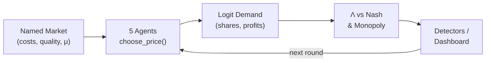
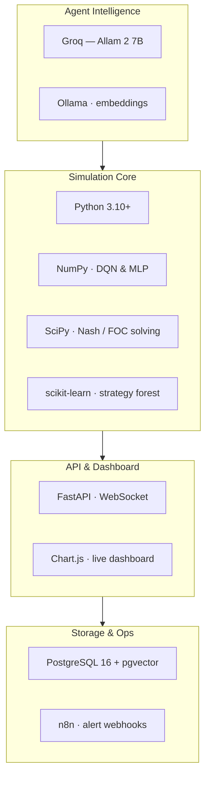
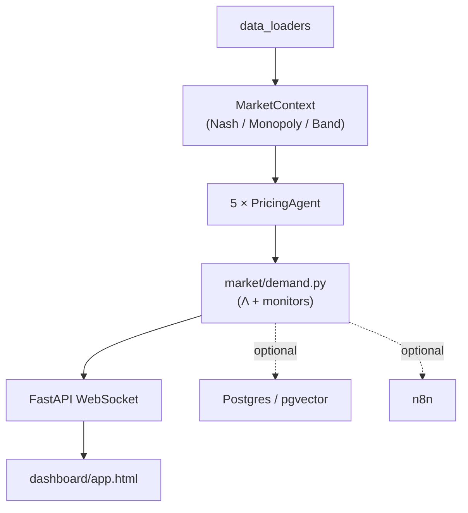

<div align="center">

# ECHO

### Emergent Collusion in Heterogeneous Oligopolies

A closed laboratory for *algorithmic tacit collusion* — five independent pricing programs post fares in a repeated Bertrand market. Nobody is told to collude. We measure how far the average price sits between competition and a cartel, and try to detect that from the fare board alone.

[](https://www.python.org/)
[](https://fastapi.tiangolo.com/)
[](https://numpy.org/)
[](https://groq.com/)
[](https://www.postgresql.org/)
[](#license)

[Live Demo (static playback)](https://echo-green-pi.vercel.app) · [Quick Start](#run) · [Limits](#limits)

</div>

> **Not a legal finding. Not a live ticket feed.** The Vercel demo is static playback; the actual engine runs locally.

---

## Table of Contents

- [Why It Exists](#why-it-exists)
- [How a Round Works](#how-a-round-works)
- [Demand and Λ](#demand-and-λ)
- [Agents](#agents)
- [Markets](#markets)
- [Detection](#detection)
- [Tech Stack](#tech-stack)
- [Architecture](#architecture)
- [Run](#run)
- [Limits](#limits)
- [References](#references)
- [Authors](#authors)

---

## Why It Exists

Airlines, ride-hailing, retail, and housing already let software set prices. A classical cartel is a meeting. **Tacit** collusion is quieter: separate profit-maximisers learn that price wars are expensive, so they keep prices high — no WhatsApp group, no shared weights. That's hard to prosecute.

ECHO holds the market fixed, swaps only the *brain*, and asks two questions:

1. Do learners settle above Nash equilibrium?
2. Can an outsider see it happening from the fare board alone?

---

## How a Round Works



Agents see their own cost, the trading band, and last round's prices and profits. They **never** see rivals' weights, Q-tables, or scratchpads.

---

## Demand and Λ

Multinomial logit demand (Anderson, de Palma & Thisse, 1992):

$$
s_i(p)=\frac{\exp((a_i-p_i)/\mu)}{\sum_j\exp((a_j-p_j)/\mu)+\exp(a_0/\mu)}
$$

$$
\pi_i=(p_i-c_i)\,s_i\,M
\qquad
\Lambda=\frac{\bar p-p_{\mathrm{Nash}}}{p_{\mathrm{Monopoly}}-p_{\mathrm{Nash}}}
$$

| Symbol | Meaning |
|:---|:---|
| $\mu$ | Price sensitivity (dataset-specific; not a global constant) |
| Nash | No firm wants to change price *alone* (fixed-point FOC) |
| Monopoly | One price maximising industry profit |
| $\Lambda\approx 0$ | Competitive market |
| $\Lambda\approx 1$ | Joint-cartel pricing |
| $M$ | Market size; orchestrator uses 1 |

The trading band is cut from **this market's own** Nash–monopoly span (`resolve_price_band`) — never a fixed rupee markup. Λ is the official score; every other sensor is supporting evidence. A high Λ is only treated as serious if it **persists**.

---

## Agents

Same stage game, five different minds. Heuristics act as the control group — if they already look like a cartel, the rulers themselves are wrong.

| Mode | Implementation | Role |
|:---|:---|:---|
| `dummy` | Steady / follower / undercut | No learning (control) |
| `rl` | Tabular Q-learning, 15-rung grid | Calvano-style RL |
| `dqn` | NumPy MLP 5→64→32→15, replay buffer, target net | Live demo default |
| `llm` | Groq **Allam 2 7B**, `<scratchpad>` + `<price>` | Language as pricing officer |
| `rag` | LLM + pgvector + Ollama embeddings | CLI only (`--db`) |

Dashboard exposes heuristic, Q-learning, DQN, and LLM modes. RAG is CLI-only and not in the website dropdown.

**Typical lab Λ** (order of magnitude, this engine):

| Agent | Λ range |
|:---|:---|
| Heuristic | ~0.15 |
| Q-learning | ~0.70 – 0.80 (after long horizon) |
| DQN | ~0.61 – 0.85 |
| LLM | ~0.80 – 0.90 |

The prompt never contains the word "collude."

---

## Markets

Simulated Bertrand always draws the moving lines. Series calibrate costs, μ, and names, and may overlay on top. Failed live fetches set `is_fallback` — those runs are **not** empirical proof.

| Dataset | Calibration |
|:---|:---|
| `airlines` | DEL–BOM static params (IndiGo, Air India, SpiceJet, Vistara, Akasa) — demo market |
| `gasoline` | BLS via FRED, five US divisions |
| `amazon` | Local CSV, wireless earbuds |
| `crypto` | CoinGecko BTC/USD venues |
| `rideshare` | Static Uber/Lyft-style costs |

A tightness proxy on real series is **not** the Nash-anchored Λ. Overlay ≠ "these firms collude."

---

## Detection

| Sensor | Job |
|:---|:---|
| Λ monitor | Streak thresholds — watch $>0.3\times5$, warning $>0.5\times10$, alert $>0.7\times10$ |
| Quality shock | Cuts one firm's quality (15 / 30 / 50%); co-movement is a lab sketch of coupling, not a court finding |
| Scratchpad sentiment | LLM memos only |
| Strategy labels | Nine features; live path is rule-based unless a forest is trained; can disagree with Λ |
| Forecast | Lagged average prices at end of run |
| NLP clustering | In repo; not wired to the live API |
| n8n | Optional webhook on alerts |

At the end of a run, `analysis/run_pack.py` wipes `analysis/latest_run/` and writes fresh figures — prices, Λ, profits, shares, snapshot, optional real overlay, and a per-firm roster. The roster is a **lab** label, not a legal one.

---

## Tech Stack



| Layer | Technology |
|:---|:---|
| Language | Python 3.10+ |
| Numerics / RL | NumPy (DQN, MLP), SciPy (Nash/FOC) |
| ML | scikit-learn (strategy classifier) |
| LLM inference | Groq — `allam-2-7b` |
| Embeddings | Ollama (RAG mode only) |
| API / Realtime | FastAPI + WebSocket |
| Dashboard | Chart.js (`dashboard/app.html`) |
| Persistence | PostgreSQL 16 + pgvector (optional) |
| Automation | n8n (optional alert webhooks) |
| Orchestration | Docker Compose |

---

## Architecture



`run_simulation.py` is the CLI entry point. `api_server.py` runs the live lab. Docker Compose ships Postgres 16 + pgvector (host port **5433**) alongside n8n. Ollama is used for embeddings only, not chat.

---

## Run

```bash
git clone https://github.com/ARYANRAJ1121/ECHO.git
cd ECHO
pip install -r requirements.txt
```

Set up `.env`:

```
GROQ_API_KEY=...          # required for LLM / RAG modes
ECHO_DB_*=...              # optional, for Postgres
N8N_WEBHOOK_URL=...        # optional, for alerts
```

**Start the lab:**

```powershell
.\start_echo.ps1 quick      # UI only
.\start_echo.ps1            # Docker + checks + server
.\start_echo.ps1 fullrun    # sims, figures, server
```

Dashboard: **http://127.0.0.1:8000/dashboard/app.html**

**Run a simulation directly:**

```bash
python run_simulation.py --dataset airlines --mode dqn --rounds 500
python run_simulation.py --dataset airlines --mode rag --rounds 10 --db
```

---

## Limits

- Prices are simulated, not real market ticket prices.
- Λ is an index, not a legal determination.
- The Vercel demo is static playback only.
- `airlines` / `rideshare` datasets are calibrated parameters, not a live GDS feed.
- FRED / CoinGecko fetches can fall back to defaults on failure.
- The live Random Forest strategy classifier is untrained by default.
- RAG mode and NLP clustering are not on the main dropdown / live path.

---

## References

1. Calvano, E., Calzolari, G., Denicolò, V. & Pastorello, S. (2020). *Artificial intelligence, algorithmic pricing, and collusion.* American Economic Review.
2. Anderson, S. P., de Palma, A. & Thisse, J.-F. (1992). *Discrete Choice Theory of Product Differentiation.* MIT Press.
3. Mnih, V. et al. (2015). *Human-level control through deep reinforcement learning.* Nature.
4. Fish, S. et al. (2024). *Algorithmic collusion by large language models.*

---

## Authors

**Aryan Raj** — engine, agents, API, dashboard
**Nikita Agarwal & Pranav Kudesia** — documentation

<div align="center">

Licensed under the **MIT License**

</div>
